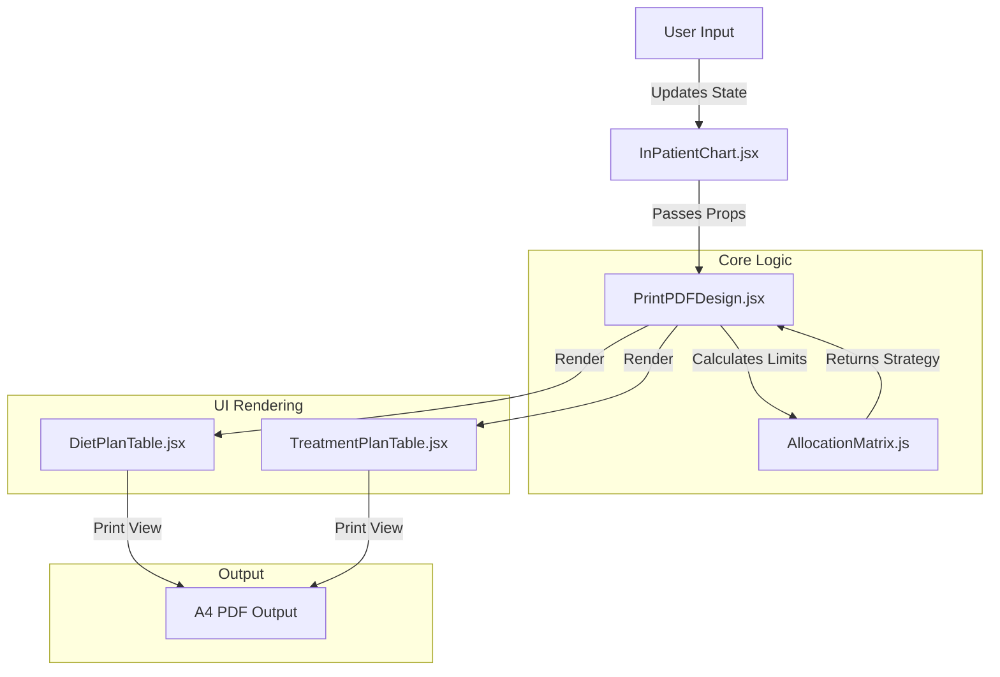

# System Architecture

## 🏗️ High-Level Overview

**InPatient Chart** is a client-side Single Page Application (SPA) built with React and Vite. It is designed to function as a smart digital form that replaces physical clipboard charts in veterinary clinics.

The core architectural goal is **"Print-First Design"**. Unlike typical web apps where printing is an afterthought, this application is engineered specifically to generate a pixel-perfect A4 PDF output while providing a user-friendly interactive web interface for data entry.

### Data Flow

## 🧩 Architectural Patterns

### 1. Separation of Concerns (Web vs. Print)
The application maintains two simultaneous visual states using CSS:
- **Web UI**: Interactive elements, buttons, inputs, soft colors, and scrollbars.
- **Print UI**: High-contrast, black & white, strict A4 dimensions, hidable controls.

This is achieved via Tailwind's `print:` modifier and standard CSS media queries (`@media print`).

### 2. Centralized State Management
State is lifted to the highest necessary level (`InPatientChart.jsx`) to ensure synchronization between:
- The input forms (Admission details).
- The dynamic tables (Diet & Treatment).
- The validation logic (Row limits).

### 3. Computation-Heavy Rendering
The `PrintPDFDesign.jsx` component acts as the layout engine. On every render (state change), it:
1. Recalculates the available space on the A4 page.
2. Determines if new rows can be added based on the **D + T = 11** formula.
3. Passes these constraints down to child components to enable/disable UI actions.

## 🛠️ Technology Stack

| Component | Technology | Version | Purpose |
|-----------|------------|---------|---------|
| **Core** | React | 19.2.0 | UI Component Library |
| **Build Tool** | Vite | 7.2.4 | Fast bundling and HMR |
| **Styling** | Tailwind CSS | 4.1.18 | Utility-first styling & Print layout |
| **Language** | JavaScript (ES6+) | - | Core logic |
| **PDF Generation** | Native Browser Print | - | Rendering engine (Chrome/Edge recommended) |
| **Automation** | Puppeteer | (Dev) | Headless PDF generation script |

## 🔌 External Dependencies

The project is intentionally lightweight with minimal runtime dependencies to ensure long-term stability and ease of deployment.

- **Production Dependencies**:
  - `react`, `react-dom`: Component rendering.
  - `tailwindcss`: Styling engine.
  - `@tailwindcss/vite`: Build-time CSS processing.

- **Dev Dependencies**:
  - `eslint`, `prettier`: Code quality.
  - `puppeteer`: Used in `scripts/print-pdf.js` for automated testing/export of PDFs.

## 🔒 Security & Performance

- **Client-Side Only**: No backend server is required. All data lives in the browser memory during the session. Data is lost on refresh (by design for this version), ensuring patient data isn't inadvertently stored.
- **Performance**: Virtual DOM ensures fast updates even when recalculating complex allocation logic. The bundle size is extremely small due to no heavy UI libraries (like Material UI or AntD).
